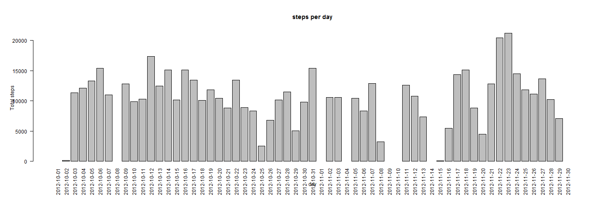
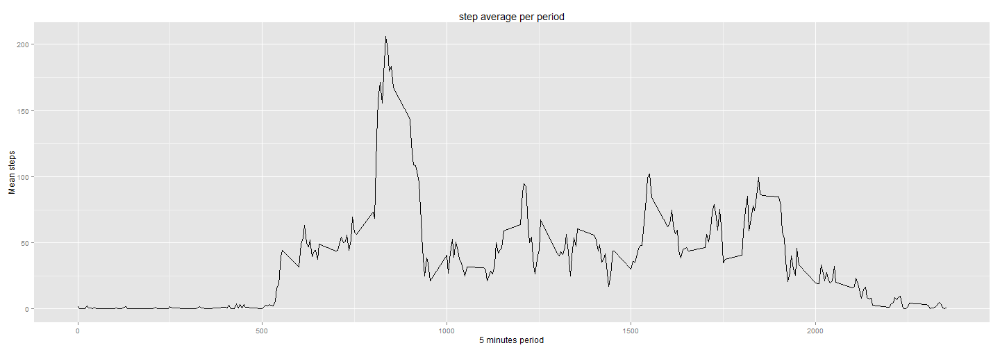
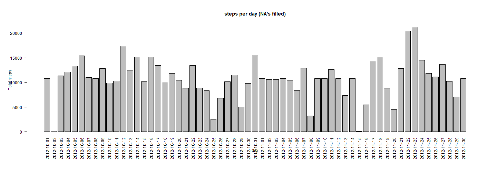
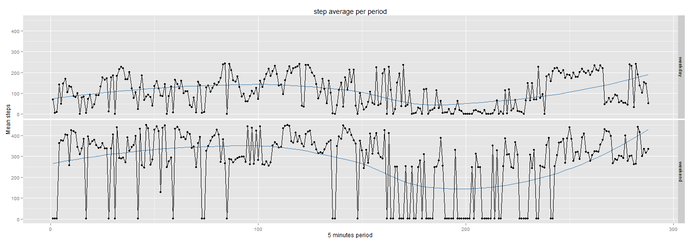

Reproducible Research: Peer Assessment 1
========================================


 by Juan M. Medel on sáb 14th of jun in 2014
-----------------------------
 
## 1. Loading and preprocessing the data
I'll load the data and remove the element which has no valid data in the steps column

```r
rawData <- read.csv(file="activity.csv") 
head(PreProcesedData)
```

```
## Error: object 'PreProcesedData' not found
```
## 2. What is mean total number of steps taken per day?

```r
stepsPerDay <- tapply(X = rawData$steps, INDEX=rawData$date, FUN = sum)
par(las = "2", mai = c(1.660000, 1.093333, 1.093333, 0.560000))
barplot(stepsPerDay,width=5 ,main="steps per day", xlab ="day", ylab = "Total steps")
```

 

```r
stepmean <- mean(stepsPerDay,na.rm=T)
stepmedian <- median(stepsPerDay, na.rm=T)
c(stepmean,stepmedian)
```

```
## [1] 10766 10765
```
The mean of the steps taken per day is 1.0766 &times; 10<sup>4</sup> and the median is 10765


## 3. What is the average daily activity pattern?

```r
stepsPerPeriod <- tapply(X = rawData$steps, INDEX=rawData$interval, FUN = mean, na.rm=TRUE)
library("ggplot2")
qplot(x=as.numeric(names(stepsPerPeriod)),y=stepsPerPeriod, geom="line") + 
    labs(title = "step average per period", x = "5 minutes period", y = "Mean steps")
```

 

```r
MaxSteps <- round(stepsPerPeriod[order(stepsPerPeriod, decreasing=T)[1]])
MaxStepPeriod <- names(MaxSteps)
#convert the character in a valid hours
time <- paste( as.character(trunc(as.numeric(MaxStepPeriod)/100)),
               as.character(as.numeric(MaxStepPeriod) - 100*trunc(as.numeric(MaxStepPeriod)/100)), 
               sep = ":")
```
The maximun average steps is 206 that happen at 8:35  


## 4. Imputing missing values
For every missing value, the inputed value will be the average steps of this period 

```r
completedData <- rawData
# if the data is missing then fullfilled with the mean for the period of days with data calculated before
for(i in 1:dim(completedData)[1]){
    if(is.na(completedData[i,1])){
        completedData[i,1] <- stepsPerPeriod[as.character(completedData[i,3])]
    }
}
totalMissingValuesRaw <- sum(is.na(rawData$steps))
totalMissingValuesCompleted <- sum(is.na(completedData$steps))
```
The total NA values are 2304 and finally the missing values on the processed data is 0


```r
stepsPerDayCompleted <- tapply(X = completedData$steps, INDEX=completedData$date, FUN = sum)
par(las = "2", mai = c(1.660000, 1.093333, 1.093333, 0.560000))
barplot(stepsPerDayCompleted,width=5 ,main="steps per day (NA's filled)", 
        xlab ="day", ylab = "Total steps")
```

 

```r
stepmeanCompleted <- mean(stepsPerDayCompleted)
stepmedianCompleted <- median(stepsPerDayCompleted)
c(stepmeanCompleted,stepmedianCompleted)
```

```
## [1] 10766 10766
```

```r
totalStepPerDay <- sum(stepsPerDay, na.rm=T)
totalStepPerDayCompleted <- sum(stepsPerDayCompleted)
c(totalStepPerDay, totalStepPerDayCompleted)
```

```
## [1] 570608 656738
```
The mean steps per day in raw data is 1.0766 &times; 10<sup>4</sup>and the steps mean per day in completed data is 1.0766 &times; 10<sup>4</sup>. As we can see the mean keep been the same because we remove the NA's previously while calculating the mean.

The median steps per day in wad data is 10765 and the steps meadian per day in completed data is 1.0766 &times; 10<sup>4</sup>. As we can se the value practicaly the same value.

There is no impact in the data because the filling values are made with the averange of steps a normal day. Nevertheless the total steps per days in raw data is 570608 and in the fullfilled data is 6.5674 &times; 10<sup>5</sup> that is higher because of the adding values that previusly are missed.

## 5. Are there differences in activity patterns between weekdays and weekends?

```r
#Create a new dataframe with two more columns, one for the weekdayname and other for the factor
rawDataWeekday <- cbind(rawData, weekdays(as.Date(rawData[,2])), numeric(dim(rawData)[1]))
names(rawDataWeekday)[4] <- "weekday"
names(rawDataWeekday)[5] <- "factorweekday"
#Create a vector with the names of the weekdays (valid for every languaje)
daysnames <- weekdays(as.Date(levels(rawDataWeekday[,2])[1:7]))
weekdays <- daysnames[1:5]
weekend <- daysnames[6:7]
#assign the factor weekday or weekend for the current day in column 2
for(i in 1:dim(rawDataWeekday)[1]){
    if(rawDataWeekday[i,4] %in% weekdays) rawDataWeekday[i,5] <- 1
    if(rawDataWeekday[i,4] %in% weekend) rawDataWeekday[i,5] <- 2
}
rawDataWeekday$factorweekday <- as.factor(x=rawDataWeekday$factorweekday)
levels(rawDataWeekday$factorweekday) <- c("weekdays", "weekend")
#split the data on weekend and weekdays for the interested data (steps and interval) and calculate the mean of the steps in this perior along the days
weekdaysStepPeriod <- rawDataWeekday[rawDataWeekday$factorweekday=="weekdays",c(1,3)]
stepsPerPeriodWeekday <- tapply(X = weekdaysStepPeriod$steps, INDEX=weekdaysStepPeriod$interval,
                                FUN = mean, na.rm=TRUE)
weekendStepPeriod <- rawDataWeekday[rawDataWeekday$factorweekday=="weekend",c(1,3)]
stepsPerPeriodWeekend <- tapply(X = weekendStepPeriod$steps, INDEX=weekendStepPeriod$interval,
                                FUN = mean, na.rm=TRUE)
#Create a dataframe that hold the information in ordet to create the plot
stepsPerPeriodWeekday <- cbind(names(stepsPerPeriodWeekday),stepsPerPeriodWeekday,character(length(stepsPerPeriodWeekday)))
stepsPerPeriodWeekday <- as.data.frame(stepsPerPeriodWeekday)
names(stepsPerPeriodWeekday) <- c("period", "steps", "factorWeek")
stepsPerPeriodWeekday$factorWeek <- "weekday"

stepsPerPeriodWeekend <- cbind(names(stepsPerPeriodWeekend),stepsPerPeriodWeekend,character(length(stepsPerPeriodWeekend)))
stepsPerPeriodWeekend <- as.data.frame(stepsPerPeriodWeekend)
names(stepsPerPeriodWeekend) <- c("period", "steps", "factorWeek")
stepsPerPeriodWeekend$factorWeek <- "weekend"
#joint the complete dataframe:
stepsPerPeriodFatorWeek <- rbind(stepsPerPeriodWeekday,stepsPerPeriodWeekend)
stepsPerPeriodFatorWeek$factorWeek <- as.factor(stepsPerPeriodFatorWeek$factorWeek)
stepsPerPeriodFatorWeek$period <- as.numeric(stepsPerPeriodFatorWeek$period)
stepsPerPeriodFatorWeek$steps <- as.numeric(stepsPerPeriodFatorWeek$steps)
qplot(x = period, y = steps, data = stepsPerPeriodFatorWeek, facets = factorWeek ~ .,) + 
    labs(title = "step average per period", x = "5 minutes period", y = "Mean steps") + 
    geom_smooth(method = "auto", se=FALSE, col="steelblue") + geom_line()
```

```
## geom_smooth: method="auto" and size of largest group is <1000, so using loess. Use 'method = x' to change the smoothing method.
## geom_smooth: method="auto" and size of largest group is <1000, so using loess. Use 'method = x' to change the smoothing method.
```

 

```r
stepsMeanWeekday <- mean(as.numeric(stepsPerPeriodWeekday$steps), na.rm=T)
stepsMeanWeekend <- mean(as.numeric(stepsPerPeriodWeekend$steps), na.rm=T)
c(stepsMeanWeekday, stepsMeanWeekend)
```

```
## [1] 106.61  81.77
```
As you can see on the resume the total steps in weekdays is 106.6111 that is bigger than in weekend with 81.7674 and the graphic show that the deviation is higher in weekend that in weekdays
